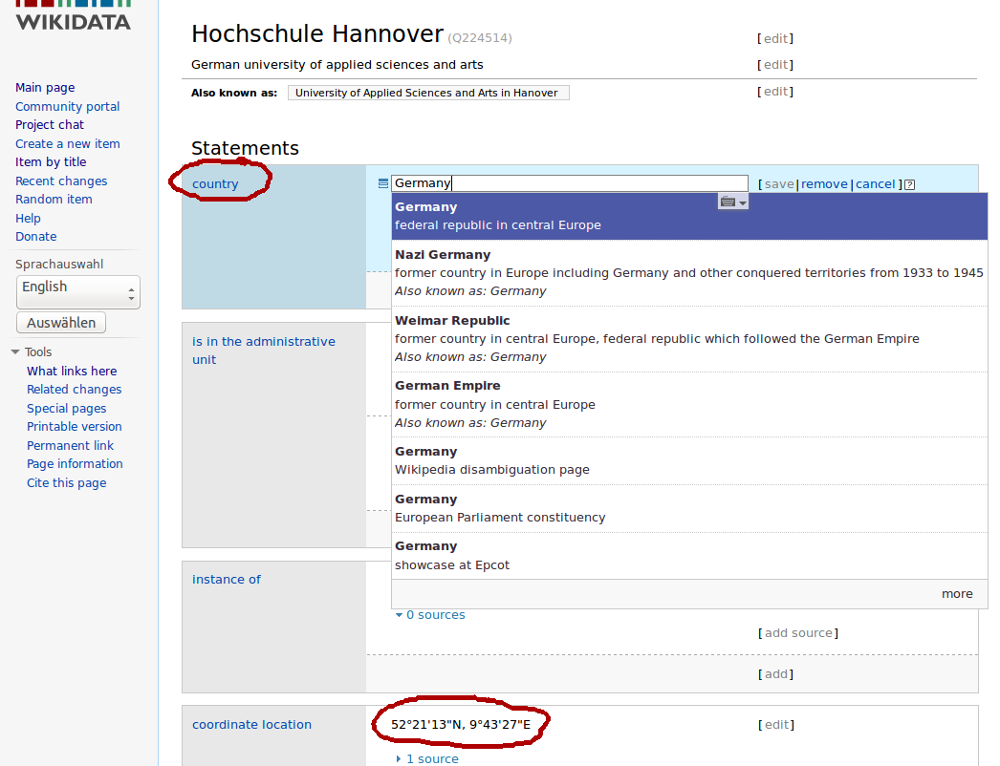
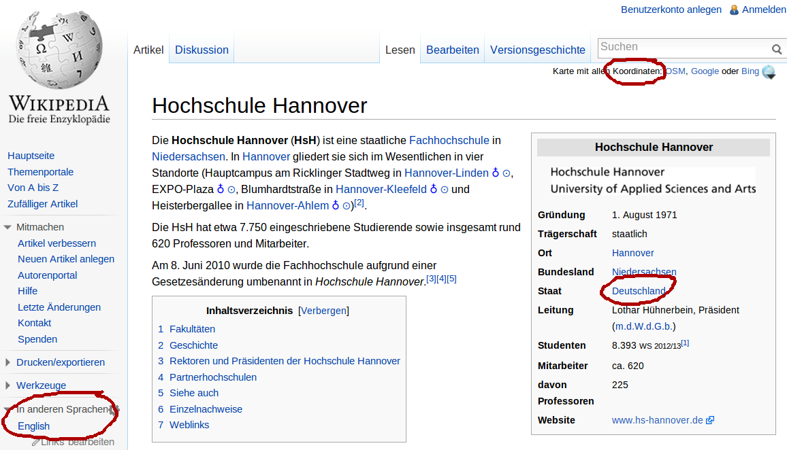

% Normdaten in Wikidata
% Jakob Voß
% 2013-12-10, Hochschule Hannover

## Wikidata

<http://www.wikidata.org/>

* Datenbank in Form eines offenen Wikis
* Entwickelt seit April 2012 von Wikimedia Deutschland
* Betrieben seit Oktober 2012 von der Wikimedia Foundation

    * Wikipedia (Enzyklopädie)
    * Wikivoyage (Reiseführer) 
    * Commons (Medienarchiv)
    * ...

* Sehr innovatives und ambitioniertes Projekt\
  (wie schon Wikipedia)

----

---

## Ziel dieses Bachelor-Projekt

Projektbericht mit Antworten auf folgende Fragen:

* Was sind Normdaten?
* Was ist Wikidata?
* **Welche Arten von Normdaten beinhaltet Wikidata?**
* Worin unterscheiden sich Normdaten in Wikidata\
  von anderen verwendeten Normdaten?
* Welche Normdaten fehlen in Wikidata?
* **Wie lassen sich Normdaten aus Wikidata\
  in anderen Zusammenhängen nutzen?**
* Wie lassen sich Fehler und Lücken erkennen und 
  beheben?
* ...

## Gemeinsame Voraussetzungen

* Verständliches Schreiben (Deutsch)
* Kommunikation (Deutsch & Englisch: Mail, Wiki, Chat...)
* Eigenes Notebook mit der Möglichkeit Software zu installieren
* Keine Hemmungen
    * Inhalte der Wikimedia-Projekte in Wikidata zu ändern
    * sich in krude Syntax und Datenformate einzuarbeiten
    * Programme als Hilfsmittel auszuprobieren und zu bewerten
* Rudimentäre Fähigkeiten in
    * Programmierung
    * Statistik

## Lessons to be learned

* Projektmanagement
* Kollaboratives Arbeiten
* Datenverarbeitung und -auswertung
* Ausblick auf *"beyond cataloging"*

